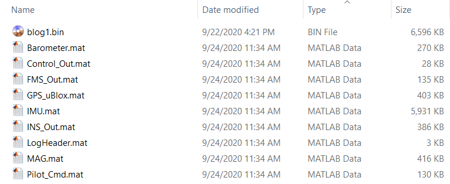

# 日志模块
FMT Firmware 日志模块提供了三种类型的日志，基本涵盖了所有日志使用场景。

1. **BLog**：二进制日志数据
2. **ULog**：字符日志
3. **Boot Log**：开机日志

## BLog日志

BLog 日志功能对于 MBD 的开发模式而言十分重要。因为 MBD 一个非常重要的仿真手段开环仿真需要实时记录算法模型的输入/输出数据，从而通过仿真得到和在硬件上运行完全一致的仿真数据。

BLog 日志以 **Bus**  (类比 Simulink 中的 Bus) 为单位，其中每个 Bus 又包含一个或者多个 **Element** (类比 Simulink 中的 Element)。所以 BLog 日志文件可以直接解析为 Simulink 可以使用的 Bus 数据。下面举例说明 BLog 日志的用法。

### 添加日志数据
这里以`IMU`日志数据为例, 演示如何添加新的日志数据.

- 定义Element：使用宏`BLOG_ELEMENT(_name, _type)`来定义一个Element，其中`_name`为Element名称，`_type`为Element类型，目前支持的类型如下：
```c
enum {
	BLOG_INT8 = 0,
	BLOG_UINT8,
	BLOG_INT16,
	BLOG_UINT16,
	BLOG_INT32,
	BLOG_UINT32,
	BLOG_FLOAT,
	BLOG_DOUBLE,
	BLOG_BOOLEAN,
};
```

构建如下所示的 IMU 数据：
```c
blog_elem_t IMU_elems[] = {
    BLOG_ELEMENT("timestamp_ms", BLOG_UINT32),
    BLOG_ELEMENT("gyr_x_radPs_B", BLOG_FLOAT),
    BLOG_ELEMENT("gyr_y_radPs_B", BLOG_FLOAT),
    BLOG_ELEMENT("gyr_z_radPs_B", BLOG_FLOAT),
    BLOG_ELEMENT("acc_x_mPs2_B", BLOG_FLOAT),
    BLOG_ELEMENT("acc_y_mPs2_B", BLOG_FLOAT),
    BLOG_ELEMENT("acc_z_mPs2_B", BLOG_FLOAT),
};
```

如果要定义矩阵或者向量类型的数据，可以使用宏`BLOG_ELEMENT_VEC(_name, _type, _num)`。其中`_num`为向量的长度。
```c
blog_elem_t IMU_elems[] = {
    BLOG_ELEMENT("timestamp_ms", BLOG_UINT32),
    BLOG_ELEMENT_VEC("gyr_radPs_B", BLOG_FLOAT, 3),
    BLOG_ELEMENT_VEC("acc_mPs2_B", BLOG_FLOAT, 3),
};
```

- 定义Bus：使用宏`BLOG_BUS(_name, _id, _elem_list)`将新的Bus添加到`_blog_bus`列表中。其中`_name`为Bus名称；`_id`为该条Bus的ID，用来唯一指代这条Bus数据；IMU_elems为Bus的Element数据。比如：
```c
blog_bus_t _blog_bus[] = {
    BLOG_BUS("IMU", BLOG_IMU_ID, IMU_elems),
	......
};
```

### 记录日志数据
日志添加完成后就可以开始记录日志数据。同样，BLog日志记录以Bus为单位，每条Bus数据可以以各自的频率进行记录。使用`blog_push_msg`函数记录一条Bus数据。

比如如下代码将在IMU数据更新之后记录IMU的数据：
```c
/* record INS input bus data if updated */
if (ins_handle.imu_updated) {
    ins_handle.imu_updated = 0;
    /* Log IMU data if IMU updated */
    blog_push_msg((uint8_t*)&INS_U.IMU1, BLOG_IMU_ID, sizeof(INS_U.IMU1));
}
```
其中`INS_U.IMU1`为存放数据的变量, `BLOG_IMU_ID`为该条Bus的ID, `sizeof(INS_U.IMU1)`表示该条Bus数据的长度。

### 开启/关闭日志记录
可以使用`blog start/stop`指令来开启/关闭日志记录。也可以通过设置`BLOG_MODE`参数的值来自动开启/关闭BLog日志的记录：
```c
/* Determines when to start and stop logging (Blog).
0: disabled
1: when armed until disarm
2: from boot until disarm
3: from boot until shutdown  */
PARAM_DEFINE_INT32(BLOG_MODE, 0),
```

### 日志解析
在 Matlab 中执行 FMT_Model/utils/log_parser/parse_blog.m 脚本并选择要解析的 BLog 日志。解析完成后会在日志目录生成 `*.mat` 日志文件，每个文件代表一个 Bus 的数据，如下图所示。其中 LogHeader 为日志头数据，里面包含日志和参数信息。



### BLog指令
TO BE ADDED

## ULog日志
[ULog](https://www.rt-thread.org/document/site/programming-manual/ulog/ulog/) 为 RT-Thread 提供的系统组件，提供文字日志记录的功能。文字日志可以用来输出系统的一些调试信息，从而供开发者进行问题定位。FMT支持将ULog输出到控制台和文件系统。

使用如下接口输出ULog日志信息：
```c
ulog_e(TAG, ...)    // Error
ulog_w(TAG, ...)    // Warning
ulog_i(TAG, ...)    // Info
ulog_d(TAG, ...)    // Debug
```

ULog日志信息将被打印在控制台，并且同时被存储在`/log/$session_id/ulog.txt`中 (需打开 `ENABLE_ULOG_FS_BACKEND` 宏开关)。
```c
[1708] W/Status: FMS Unknown Mode
[1714] I/Status: FMS Status Disarm
[5479] I/Status: FMS Position Mode
[8268] I/Status: FMS Altitude Hold Mode
[9104] I/Status: FMS Manual Mode
[13034] I/Status: FMS Status Standby
[15005] I/Status: FMS Status Arm
[21673] I/Status: FMS Status Disarm
```

## Boot Log 开机日志

开机日志将记录从开机到系统信息打印完成之后的控制台输出信息并存储到`/log/$session_id/boot_log.txt`。