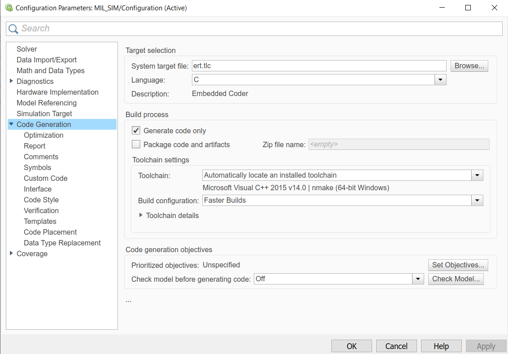

# 代码生成和合入

通过 Simulink Embedded Coder 可以将 Simulink 模型编译生成 C/C++ 代码。FMT Model 里的算法模型 () INS，FMS，Control 和 Plant) 已经配置为可以生成嵌入式 C 代码。如果要修改代码生成配置项，可以进入模型配置界面，修改`Code Generation`下的配置项。

双击进入要编译的模型，然后点击 `Build Model` 按钮生成 C 代码。

比如进入 Controller 模型，点击 Build Model 按钮后，将出现如下窗口。其中 **Location of Generated Source Code** 即为生成代码的路径。

## 生成代码

- 打开要生成代码的算法模型，点击`Build Model`按钮。
- Simulink 会先开始编译模型。以 Controller 模型为例， 如果编译通过则会出现如下界面。

- **Location of Generated Source Code** 即为生成代码的路径。

## 代码合入

要将模型生成的代码合入到 FMT飞控上非常简单，只需要把生成的文件复制到对应模块的位置。

这里还是以 Controller为例。假设 Controller 模型生成的代码路径为 `$model_codegen/`。将该路径下的 `*.c,*.h` 文件复制并替换到 `$FMT_Firmament/fmt_fmu/src/module/Controller/lib` 下即完成代码部署。

其它模型的部署方式相同，具体部署路径如下：

- INS: `$FMT_Firmament/fmt_fmu/src/module/INS/lib` 
- FMS: `$FMT_Firmament/fmt_fmu/src/module/FMS/lib` 
- Plant: `$FMT_Firmament/fmt_fmu/src/module/Plant/lib` 

> 注意：如果生成的模型不符合 FMI 的模型接口标准，则在代码部署完成后，还需要修改 `<model_name>_model.c` 对应模型的输入/输出代码。具体方式为修改模型输入/输出的 uMCN Topic 以匹配新的模型接口。

如果您的算法模块是用 C/C++进行编写，可以用过`s-function`的方式生成Simulink模块。也可以提供模型接口函数接口 `<Model>_init()`，`<Model>_step()` 和 `<Model>_terminate()`并合入飞控中。