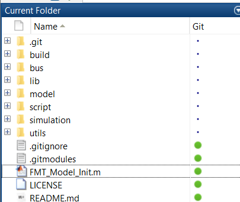

# 快速上手
FMT Model基于Matlab 2018b环境开发，需要包含Matlab/Simulink和一些三方库的License。推荐使用Matlab 2018b，更新的版本应该也可以，但是没有充分测试。

## 初始化
打开Matlab，进入`$FMT_Model`目录并运行`FMT_Model_Init.m`脚本。脚本会加载总线文件并且初始化模型和路径。初始化成功后，应该可以看到$FMT_Model目录下的所有文件夹（包括子文件夹）都已经被加入到Matlab的路径中。

## 目录结构
FMT Model的目录如图所示。下面分别介绍各个目录的作用以及存放的文件：

- *build*: 该目录用来存放模型生成的源代码（C/C++）文件以及编译模型所产生的中间文件。
- *bus*: 该目录用来存在总线 (Bus) 的数据文件。
- *lib*: 该目录包含模型库文件。
- *model*: 该目录用来存放算法模型库，里面包括导航（INS），飞行管理系统（FMS），控制器（Controller）和对象模型（Plant）。
- *script*: 该目录用来存放工程脚本文件。
- *simulation*: 该目录包含仿真模型文件。
- *utils*: 该文件包含一些工具脚本，如传感器校准脚本，日志解析脚本等。

