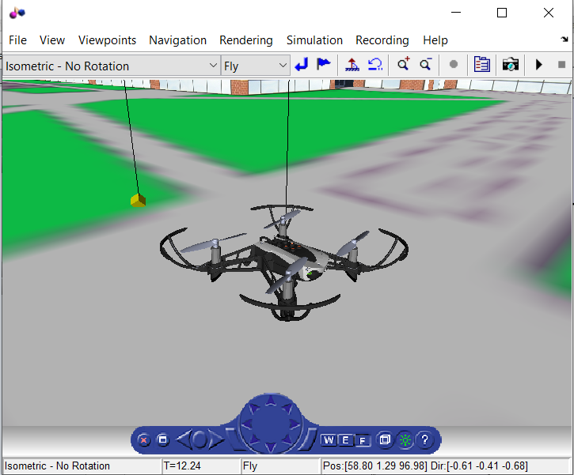
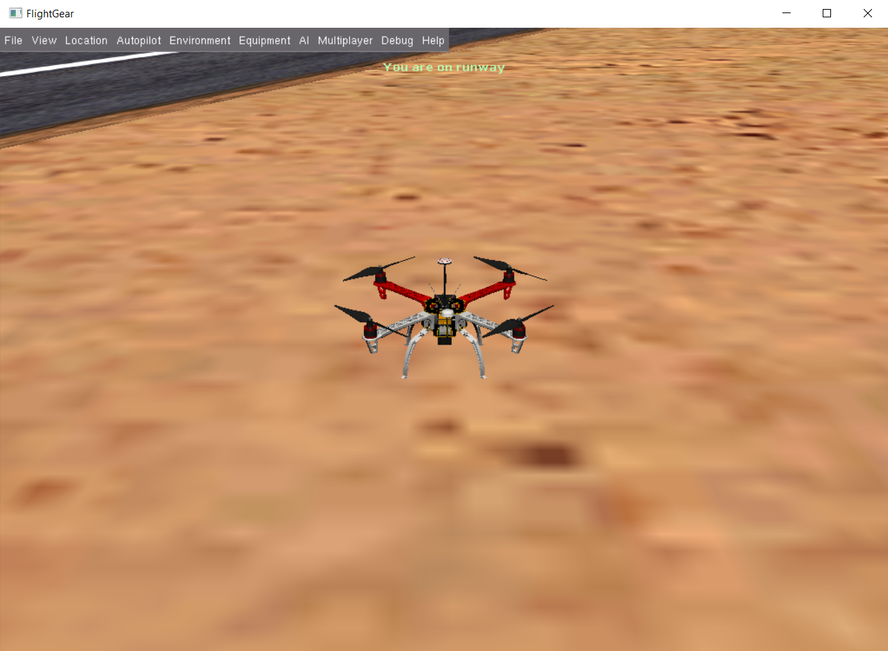

# 模型在环仿真

模型在环仿真是完成模型的初步设计后进行的第一步仿真工作。刚设计好的算法难免会有很多缺陷和Bug，我们肯定不会希望直接拿到实际的平台上进行验证，因为这往往可能导致灾难性的后果。而模型在环仿真可以帮助我们完成系统功能的初步测试。 FMT Model 的 MIL 仿真模型结构如下图所示。

它包括我们前面所述的四个算法模块，我们可以根据应用场景和需求从算法库中选择对应模型。如果没有满足要求的模型则可以在现有的模型基础上进行二次开发。MIL 仿真为一个完整的闭环仿真体系，由于包含了被控对象模型 (Plant)，可以将电机输出的信号转化为被控对象的状态信息，如姿态，速度和位置等。MIL 可以很好地验证算法的初步功能，特别是跟被控对象无关的功能（如状态机和导航），而与被控对象相关功能 (如控制器) 的仿真精度，则取决于被控对象模型建立的精度。通过科学的建模手段对被控对象进行建模，可以得到和真实世界行为十分接近的仿真数据。

## 运行 MIL 仿真

- 执行 `$FMT_Model/FMT_Model_init.m` 脚本，对 FMT Model 进行初始化。如果已经初始化过，则无需重复初始化。
- 打开开环仿真模型 `$FMT_Model/simulation/MIL_SIM.slx`。
- 选择遥控信号的输入方式。遥控信号输入模块`RC`有两种输入方式，分别为遥感输入 (Joystick) 和飞控输入 (Mavlink)。可以通过右键单击RC模块，通过`Variant->Label Model Active Choice`进行输入模式选择。
  1. Joystick: 游戏手柄输入。Matlab支持大部分的游戏手柄，通过usb线将游戏手柄接入电脑即可，无需安装驱动和单独配置。
  2. Mavlink: 选择这种模式，飞控将通过mavlink包将遥控信号传给Simulink。所以需要将遥控器连接至飞控，在`fmtconfig.h`文件中打开飞控的``FMT_OUTPUT_PILOT_CMD` `的宏开关，重新编译下载固件到飞控中，并将飞控通过usb线连接至电脑。在RC/Mavlink模块中选择飞控对应的串口端口。
- 点击 `Run` 运行模型。

## 查看仿真数据
MIL 执行完后，可以查看模型的输出和任意内部状态的数据。Matlab/Simulink 提供了很多的数据可视化的方式，比如`Scope`示波器模块，Matlab的plot函数等。这里仅介绍最常用的一种，那就是`Simulation Data Inspector` 。

- 首先需要打开需要记录信号的 Logging 功能。具体方式为单击要记录的信号线，这时候会出现三个蓝色的小圆点，将鼠标移动到小圆点上，会出现 `Enable Data Logging` 的选项。选择，这时候信号线旁边将出现一个小的信号标志 (如下图所示)，表示这条信号将被记录下来。
- 然后运行 MIL 模型。
- 模型运行结束后，打开 Simulation Data Inspector (也可在 MIL 运行的过程中观察)，打开后的界面如下。左边列出了所有已经记录的信号（名称跟所记录信号线的名称相同）。可以在Filter Signals中输入信号的名称进行查找。选中要查看信号，会在右边进行显示。关于更多的操作方法，请参考 Matlab 官方文档。

## 可视化
`Plant`模块输出了无人机的状态信息，如姿态，位置等，可以将这些信息送给3D软件进行可视化。Matlab内部提供了一个无人机的3D模型，我们可以通过它来显示无人机的状态，当然也可以将数据传递给其它仿真器，如Flightgear，Gazebo等来进行可视化显示。

